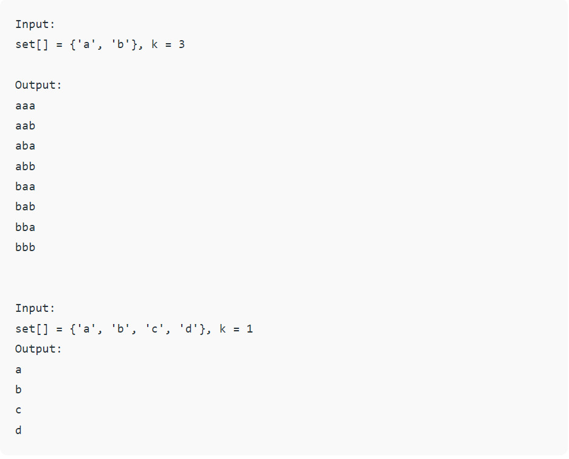

# Recursive Problems

## Set of Characters
Given a set of characters and a positive integer k, print all possible strings of length k that can be formed from the given set.



```c#
 public static void caracters(char[]array, string input, int k)
        {
            if(input.Length == k)
            {
                Console.WriteLine(input);
                return;
            }

            for(int i = 0; i < array.Length; i++)
            {
                caracters(array, input + array[i], k);
            }

        }
```
* The base case will be when our string reaches the k length
* We then iterate the array of characters and we add it to the string